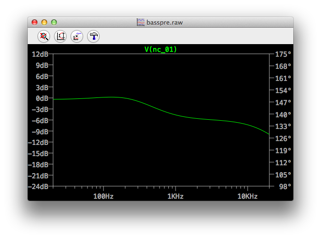
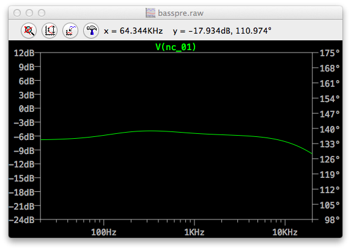
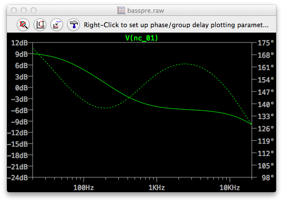
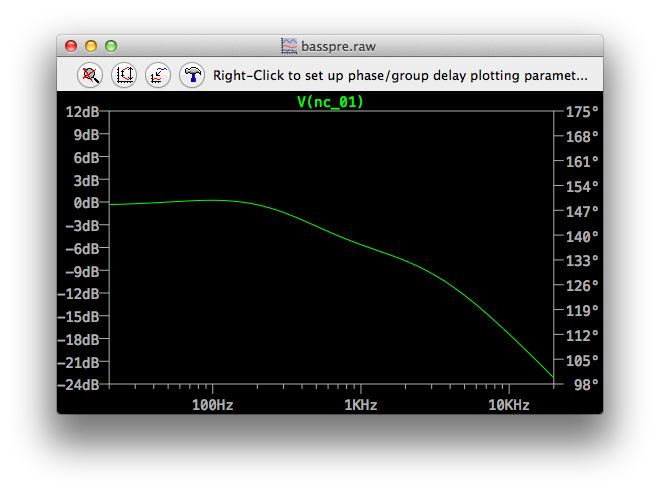
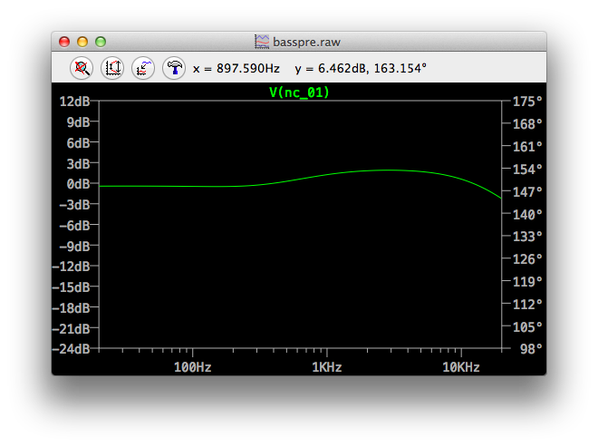
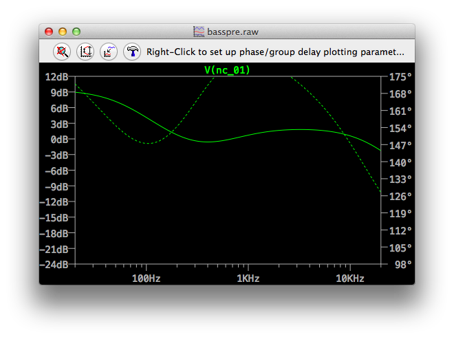
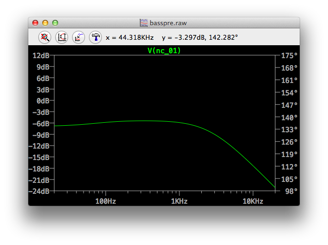

# Basspre MM-2

This is a bass pre-amp meant for internal use in active basses with humbucker
inputs.  The circuit is a tribute to the classic 2-band pre-amp used in the
original MusicMan Stingray, with a few modifications.  The pre-amp has a
buffered input to maintain very low thermal noise, it uses a rail-splitter IC
instead of a resistor divider to ensure clean tone with very low power, and
the voicing is modified to be less treble-heavy to ensure low EM interference.

Here's some simulations of the voicing at various pot positions:

## Flat

## Bass Cut

## Bass Boost

## Treble Cut

## Treble Boost

## Both Boost

## Both Cut

