# Basspre MM2

This is an open-source bass pre-amp meant for internal use in active basses with humbucker
inputs.  The circuit is a tribute to the classic 2-band pre-amp used in the
original MusicMan Stingray, with a few modifications.

Board layout and schematic files are in EAGLE format, while the simulations are
done in LT-SPICE.

The pre-amp has a buffered input to maintain very low thermal noise, it uses a rail-splitter IC
instead of a resistor divider to ensure clean tone with very low power, and
the voicing is modified to be less treble-heavy to ensure low EM interference.

[PDF Schematic](schem.pdf)

[OSH Park Link](https://oshpark.com/shared_projects/A13YAxJk)

Here's some simulations and tests of the voicing at various pot positions:

## Flat

### Simulation

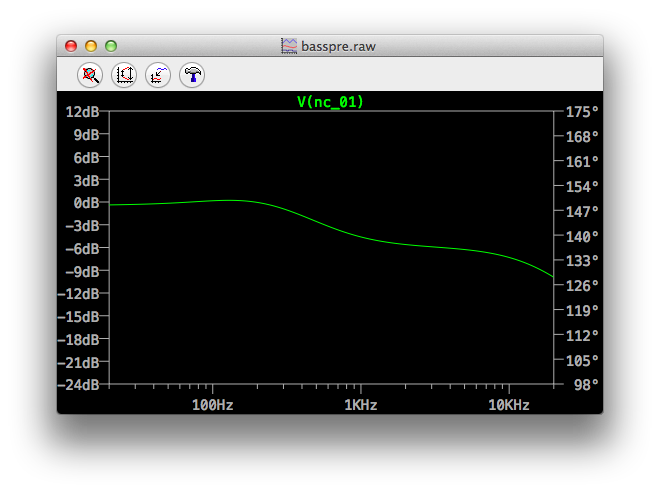

## Bass Cut

### Simulation

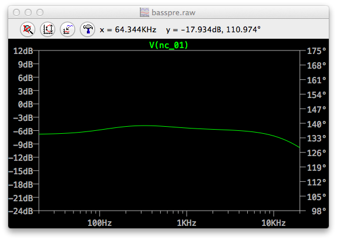

## Bass Boost

### Simulation

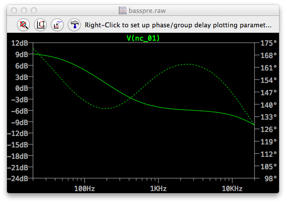

### Test

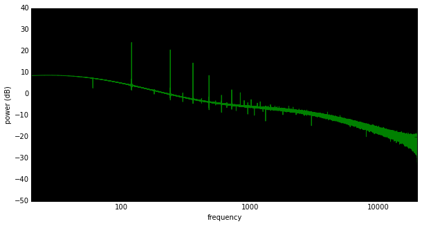

## Treble Cut

### Simulation

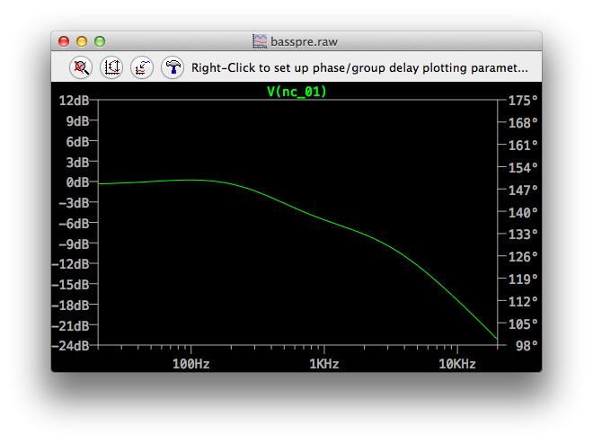

## Treble Boost

### Simulation

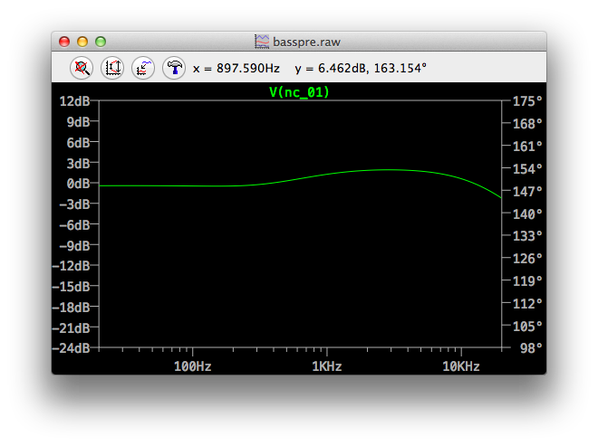

### Test

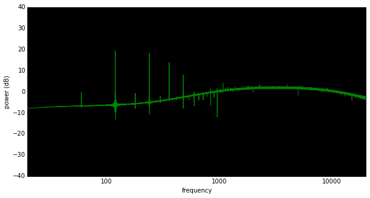

## Both Boost

### Simulation

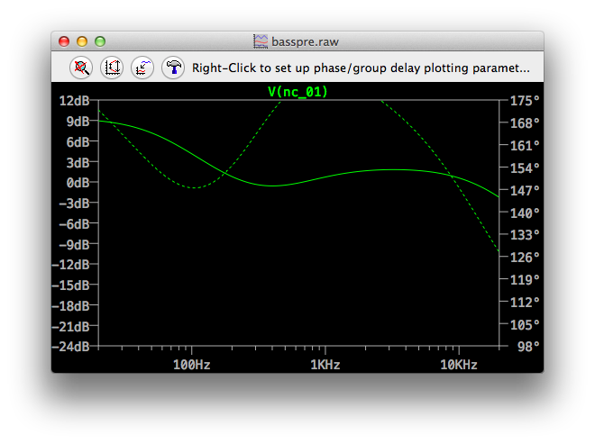

### Test

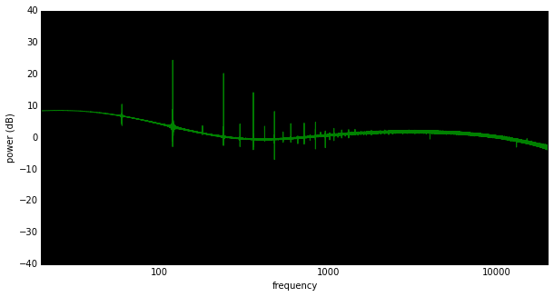

## Both Cut

### Simulation

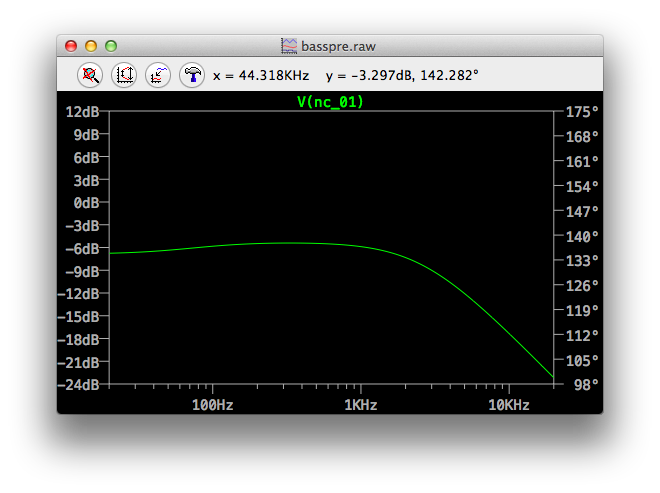

### Test

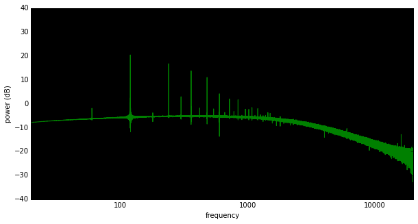

Copyright 2014, Russell McClellan, all rights reserved.

 Basspre MM-2 by <a xmlns:cc="http://creativecommons.org/ns#" href="russellmcc.com" property="cc:attributionName" rel="cc:attributionURL">Russell McClellan</a> is licensed under a <a rel="license" href="http://creativecommons.org/licenses/by-sa/4.0/">Creative Commons Attribution-ShareAlike 4.0 International License</a>.
